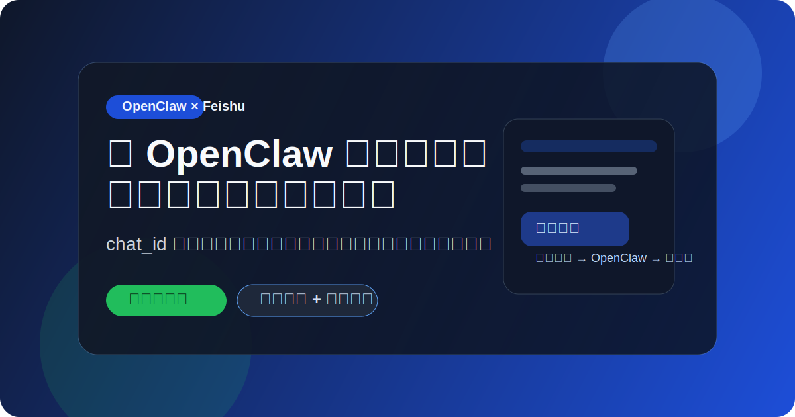
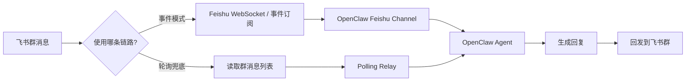
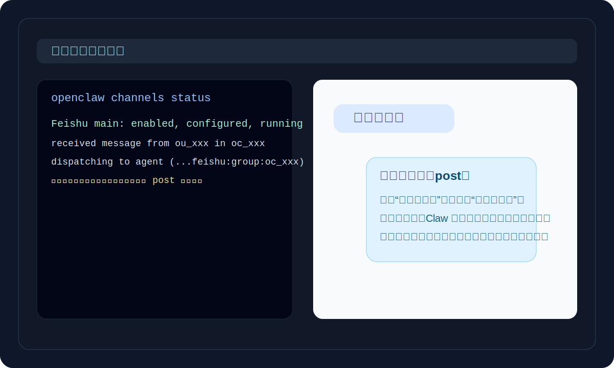
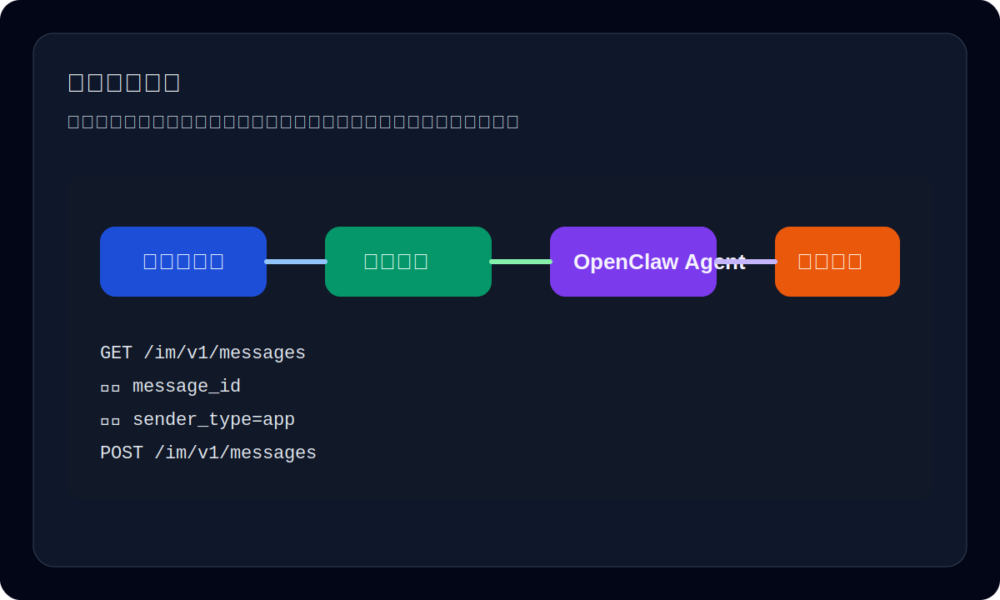

# feishu-openclaw

<p align="center">
  
</p>

<p align="center">
  
  
  
  
</p>

<p align="center">
  <strong>把 OpenClaw 接进飞书群，不止能接，还能稳定跑。</strong><br/>
  从 <code>chat_id</code> 获取、配置写入、事件排障，到轮询兜底，一套打通。
</p>

一个面向 **OpenClaw × 飞书机器人** 的可复用 Skill。  
它解决的不是“能不能接上”，而是更现实的问题：

- **怎么快速拿到 `chat_id`**
- **怎么把 OpenClaw 正确挂到飞书群里**
- **为什么消息进来了却没回复**
- **事件订阅不稳定时，怎么用轮询方案兜底**

如果你也在折腾 **OpenClaw 接入飞书 / Lark**，这个仓库可以直接帮你少踩很多坑。

## 为什么值得关注

- **上手快**：不是从零摸索，而是直接给你一套可复用脚本
- **更真实**：覆盖“看起来配置没问题，但群里就是不回”的真实场景
- **更稳**：原生事件模式跑不稳时，直接切轮询兜底
- **更适合分享**：内容按开源可发布标准整理，不内置敏感信息

## 这个项目适合谁

- 想把 **OpenClaw 接入飞书机器人** 的个人开发者
- 想把 **AI 助手接进飞书群** 做内部协作的团队
- 已经拿到 `App ID / App Secret`，但还没把消息链路跑通的人
- 飞书事件订阅已经配了，**仍然偶发不回消息** 的人

## 你能得到什么

- **自动获取飞书可见群列表**，快速找到目标 `chat_id`
- **自动改写 OpenClaw 配置**，减少手改 JSON 的出错率
- **事件订阅模式排障清单**，快速定位“没回复”到底卡在哪
- **轮询兜底脚本**，当飞书事件链路不稳定时也能继续跑

## 核心亮点

### 1. 不只是教程，而是可执行工具

仓库里不只有说明文档，还有可直接运行的脚本：

- `scripts/list_feishu_chats.mjs`  
  获取当前机器人可见的飞书群列表，并拿到对应 `chat_id`
- `scripts/configure_openclaw_feishu.mjs`  
  自动把飞书配置写入 `~/.openclaw/openclaw.json`
- `scripts/feishu_openclaw_relay.mjs`  
  在事件模式不稳定时，走“轮询群消息 → 调 OpenClaw → 回发飞书”的稳定兜底方案

### 2. 覆盖两条真实可用路径

这个项目不是只讲一种理想方案，而是把实际能跑通的两条路线都整理好了：

- **路线 A：OpenClaw 原生飞书事件订阅模式**
- **路线 B：参考 `xcode-tg` 思路的轮询兜底模式**

这样你不会卡在“理论上应该行，但就是不回”的尴尬阶段。

### 3. 公开分享友好

仓库内容默认按 **开源可分享** 标准整理：

- 不包含真实 `App Secret`
- 不包含真实 `tenant_access_token`
- 不包含任何你本地的私有凭证
- 示例统一用环境变量方式，避免 Secret 写进命令历史或仓库

## 仓库内容

- `SKILL.md`  
  Skill 的触发规则、适用场景和工作流说明
- `references/event-mode.md`  
  OpenClaw 原生飞书事件模式的配置与排障清单
- `references/polling-fallback.md`  
  轮询兜底方案的设计说明和适用边界
- `scripts/list_feishu_chats.mjs`  
  列出机器人当前可见的飞书群与 `chat_id`
- `scripts/configure_openclaw_feishu.mjs`  
  一键写入 OpenClaw 飞书配置
- `scripts/feishu_openclaw_relay.mjs`  
  飞书轮询桥：读取群消息，交给 OpenClaw 本地 agent 生成回复，再回发到群里

## 工作流总览



## 快速开始

### 1）准备环境变量

```powershell
$env:FS_APP_ID="cli_xxx"
$env:FS_APP_SECRET="your-secret"
```

### 2）读取飞书群列表

```powershell
node scripts/list_feishu_chats.mjs
```

你会看到机器人当前可见的群列表，找到目标群对应的 `oc_xxx`。

### 3）写入 OpenClaw 配置

```powershell
node scripts/configure_openclaw_feishu.mjs --chat-id oc_xxx
```

### 4）启动 OpenClaw 网关并检查状态

```powershell
openclaw gateway run --force
openclaw channels status
```

如果状态里看到类似：

```text
Feishu main: enabled, configured, running
```

说明基础接入已经成功。

## 页面预览

### 事件模式

当飞书事件订阅正常工作时，链路是：飞书消息 → OpenClaw 渠道 → Agent 回复。



### 轮询兜底模式

当事件订阅不稳定时，可以直接读取群消息列表，再把回复回发到飞书群。



## 如果事件订阅还是不稳定

当你出现下面这类情况时：

- 飞书后台已经配了 `im.message.receive_v1`
- `channels status` 看起来一切正常
- 但群里发消息还是偶发不回、延迟大、或者日志不稳定

可以直接切到轮询兜底方案：

```powershell
node scripts/feishu_openclaw_relay.mjs --chat-id oc_xxx
```

这个脚本会：

1. 轮询目标飞书群的最新消息
2. 忽略机器人自己发出的消息
3. 把用户文本交给 `openclaw agent --local`
4. 把生成结果再发回飞书群

适合需要 **先跑通、先稳定、先可用** 的场景。

## 常见问题

### 飞书里“看起来没回复”，但其实 OpenClaw 已经处理了？

有可能。飞书机器人回复不一定总是普通 `text`，有时会以 **`post` 富文本** 或 **回复原消息线程** 的形式出现。  
这时建议同时检查：

- 飞书群里是否有挂在原消息下面的回复
- OpenClaw 日志里是否出现 `received message from ...` 与 `dispatching to agent`
- 飞书消息列表接口里是否已经出现 `sender_type=app` 的回帖

### 一定要用事件订阅吗？

不一定。  
如果你的目标是“尽快可用”，轮询兜底方案通常更直观、更稳定。

### 会不会泄露 Secret？

不会。前提是你自己不要把真实凭证写进仓库。  
这个项目的示例都默认使用环境变量，不建议把 `FS_APP_SECRET` 直接写进脚本或提交到 Git。

## 安全提醒

- **不要提交真实 `App Secret`**
- **不要提交真实 `tenant_access_token`**
- **不要提交你自己的企业群 `chat_id`、用户 ID、日志原文**

建议把敏感值放在：

- 当前 shell 环境变量
- 本地 `.env`（且加入 `.gitignore`）
- Secret Manager / 系统环境变量

## FAQ

### 1. 这个仓库是给谁用的？

给想把 **OpenClaw 接进飞书群** 的开发者和团队用的，尤其适合正在做 AI 助手、内部机器人、群协作自动化的人。

### 2. 一定要走飞书事件订阅吗？

不一定。  
如果事件模式稳定，优先用事件模式；如果已经配好了但还不稳定，直接切到轮询兜底会更省时间。

### 3. 为什么飞书里“像是没回复”，但实际上已经回了？

因为飞书机器人回复有时会以 `post` 富文本或“回复原消息线程”的方式出现，不一定是最显眼的普通文本气泡。

### 4. 为什么这个项目不直接放真实配置？

因为这是公开仓库。  
示例必须默认不包含真实 `App Secret`、token、企业群 ID、用户 ID 或调试日志原文。

### 5. 只会飞书，没接触过 OpenClaw，也能用吗？

可以。这个仓库已经把“接入”“验证”“排障”“兜底”拆成脚本和步骤，按 README 跑就行。

## 为什么值得点个 Star

因为这不是一份“照着点按钮”的静态教程，  
而是一套围绕 **OpenClaw 接入飞书** 的真实落地经验总结：

- 有脚本
- 有排障
- 有兜底方案
- 有公开分享时的安全边界

如果你也在做 **AI 助手接入飞书**、**飞书群机器人协作**、**OpenClaw 渠道扩展**，欢迎一起用、一起改、一起补坑。

## 传播文案

如果你准备把这个项目发出去，可以直接参考：

- `docs/share-copy.md` —— 已整理好的朋友圈、飞书群、推特 / X、GitHub 动态文案
